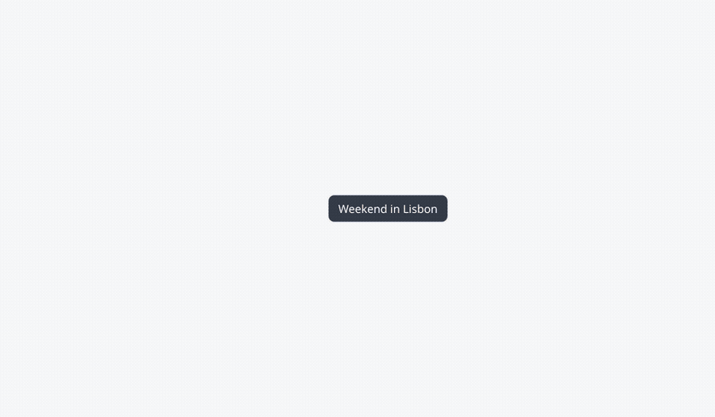
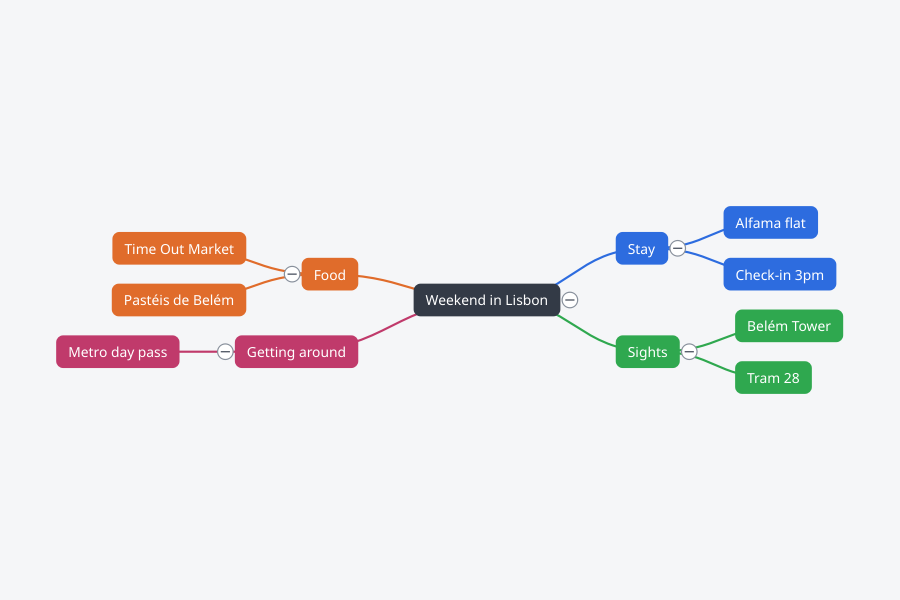
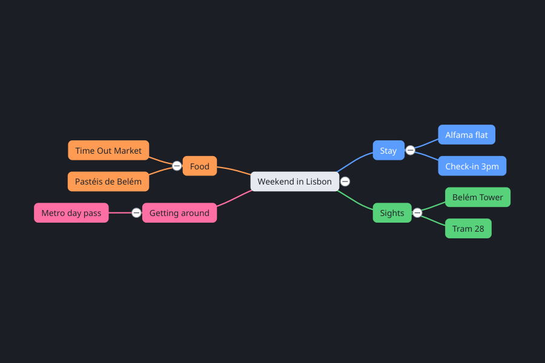
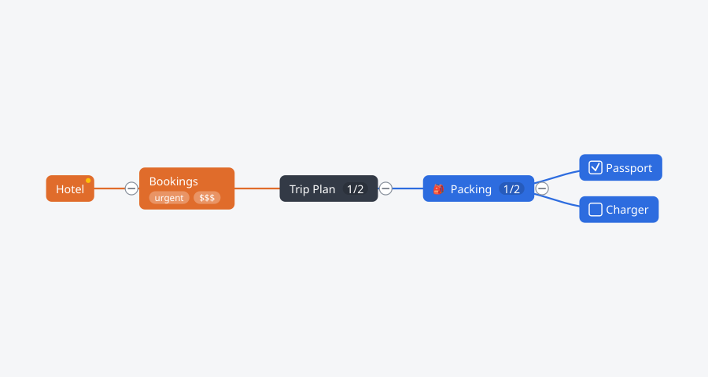
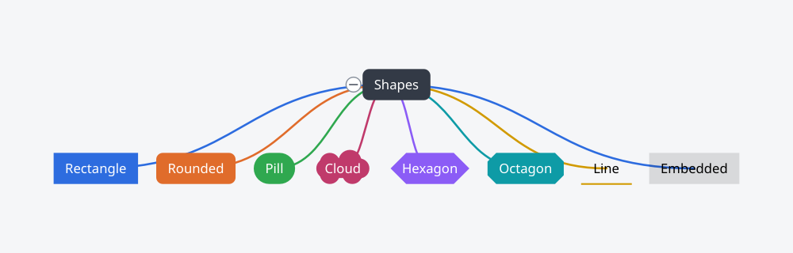
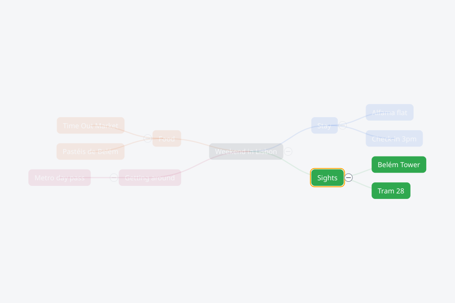
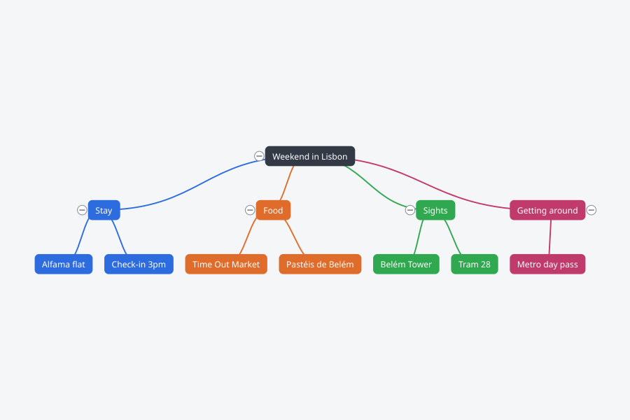
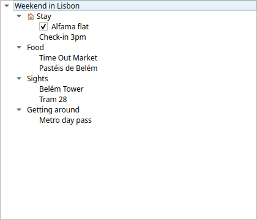

<div align="center">


# Owera MindFlow

### A MindNode-inspired, open source mind map app for Linux 🧠🐧

Branch ideas freely on an infinite canvas — fast, keyboard-first, and beautiful.

[](LICENSE)




</div>

---

Owera MindFlow turns thoughts into structure. Type, press **Tab** for a child and
**Enter** for a sibling, and watch an organic, color-coded map grow under your fingers —
no mouse required. Style it, theme it, attach tasks and notes, then flip to an outline
or export it anywhere.

### ✨ Highlights

- ⚡ **Keyboard-first** — build entire maps with `Tab` / `Enter` / `F2`, navigate with arrows
- 🎨 **Beautiful by default** — organic layout, curved branches, colorful per-branch palettes
- 🌗 **Themes** — switchable light / dark looks; 8 node shapes; custom colors & fonts
- 🧩 **Rich nodes** — tasks with roll-up progress, tags, emoji/stickers, notes, images
- 🔗 **Cross-connections** — link any two ideas with labelled, draggable curves
- 🎯 **Focus mode & search** — spotlight one branch, find any node
- 🗂️ **Outline view** — always in sync with the map
- ♻️ **Import / Export** — OPML, Markdown, FreeMind, CSV, text · PNG, SVG, PDF
- 🖥️ **Truly native** — C++17 + Qt 6, no Electron, runs on X11 and Wayland

---

## 📸 Take a look

<table>
  <tr>
    <td width="50%"><br><b>Organic, colorful layout</b><br>Balanced two-sided tree with curved branches.</td>
    <td width="50%"><br><b>Light & dark themes</b><br>Switch the whole map's look in one click.</td>
  </tr>
  <tr>
    <td width="50%"><br><b>Rich content</b><br>Checkboxes, "done/total" progress, tags, stickers, notes.</td>
    <td width="50%"><br><b>8 node shapes</b><br>Rectangle, rounded, pill, cloud, hexagon, octagon, line, embedded.</td>
  </tr>
  <tr>
    <td width="50%"><br><b>Cross-connections</b><br>Labelled, curved links between any two nodes.</td>
    <td width="50%"><br><b>Focus mode</b><br>Dim everything but the branch you're working on.</td>
  </tr>
  <tr>
    <td width="50%"><br><b>Flexible layouts</b><br>Organic, left, right, up, down, compact.</td>
    <td width="50%"><br><b>Synced outline</b><br>Edit as a list; the map updates live.</td>
  </tr>
</table>

---

## ⌨️ Keyboard-first workflow

Select a node and just type. The map grows as fast as you think:

| Key | Action |
|-----|--------|
| `Tab` | Add a **child** and start editing it |
| `Enter` | Add a **sibling** |
| `Shift`+`Enter` | New line inside a node |
| `F2` / double-click | Rename |
| `← ↑ → ↓` | Move between nodes |
| `Delete` | Delete the selected node |
| `Ctrl`+`Z` / `Ctrl`+`Shift`+`Z` | Undo / Redo |
| `Ctrl`+`L` | Connect the two selected nodes |
| `Ctrl`+`E` | Toggle the outline view |
| `Ctrl`+`Shift`+`F` / `Esc` | Focus on selection / exit focus |
| `Ctrl`+`F` | Find |
| `Ctrl`+`+` / `Ctrl`+`-` / `Ctrl`+`9` | Zoom in / out / fit |

---

## 🚀 Get started

### Build from source

Requires CMake ≥ 3.21, a C++17 compiler, Ninja, and Qt 6 (Widgets, Svg, PrintSupport, Test).

```sh
# Debian / Ubuntu dependencies
sudo apt-get install -y cmake ninja-build qt6-base-dev qt6-base-dev-tools \
  libqt6svg6-dev qt6-svg-dev

# Build & run
cmake -S . -B build -G Ninja
cmake --build build
./build/mindflow
```

### Other ways to install

- **Flatpak:** `flatpak-builder --user --install --force-clean build-flatpak packaging/flatpak/com.owera.MindFlow.yaml`
- **AppImage:** `./packaging/appimage/build-appimage.sh` (needs `linuxdeploy` + `linuxdeploy-plugin-qt`)
- **System install:** `cmake --install build --prefix /usr/local` — installs the binary, `.desktop` entry, AppStream metainfo and icon.

### Run the tests

```sh
ctest --test-dir build --output-on-failure
# or headless:  QT_QPA_PLATFORM=offscreen ./build/mindflow_tests
```

---

## 📂 Import & Export

| | Formats |
|---|---|
| **Import** | OPML · Markdown · FreeMind · Plain text |
| **Export** | PNG · SVG · PDF · Markdown · OPML · FreeMind · CSV · Plain text |

Maps are saved as a single, human-readable `.mindflow` JSON document (images embedded
as base64), so your files stay portable and inspectable.

---

<details>
<summary>🧩 <b>Architecture</b> (for contributors)</summary>

<br>

`src/model` (`Document` / `Node` / `Connection` / `Theme` + `QUndoCommand`s) is the single
source of truth. `src/canvas` (a `QGraphicsView` scene) and `src/outline` (a `QTreeWidget`)
are two presenters that observe the model, so the map and outline never diverge.
`src/layout` computes node geometry from the tree; `src/io` handles the `.mindflow`
format plus all import/export. The app shell lives in `src/app`.

```
src/
  model/    Document, Node, Connection, Theme, Commands  (no UI)
  layout/   LayoutEngine (organic / vertical / horizontal / compact)
  canvas/   MindMapView, NodeItem, BranchItem, ConnectionItem
  outline/  OutlineView
  io/       DocumentStore, Exporters, Importers
  app/      MainWindow, Inspector, main
```

</details>

## 🤝 Contributing

Issues and pull requests are welcome. Build with the steps above, keep the unit tests
green (`ctest --test-dir build`), and match the surrounding code style.

## 📜 License

[MIT](LICENSE) © Owera. *MindNode is a trademark of its respective owner; Owera MindFlow
is an independent, inspired-by project and is not affiliated with or endorsed by it.*
